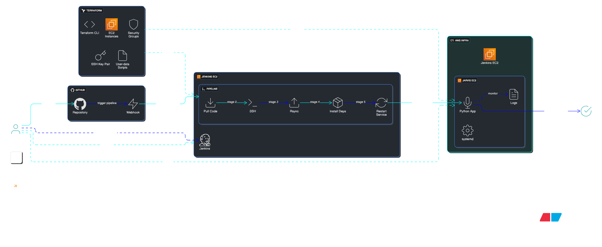
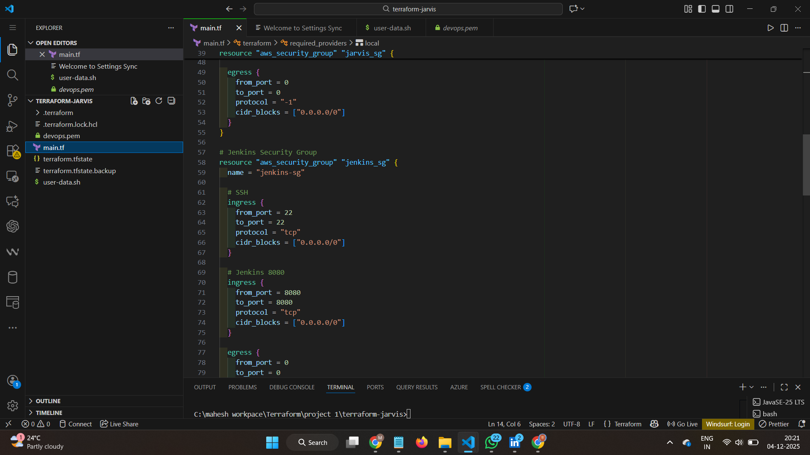
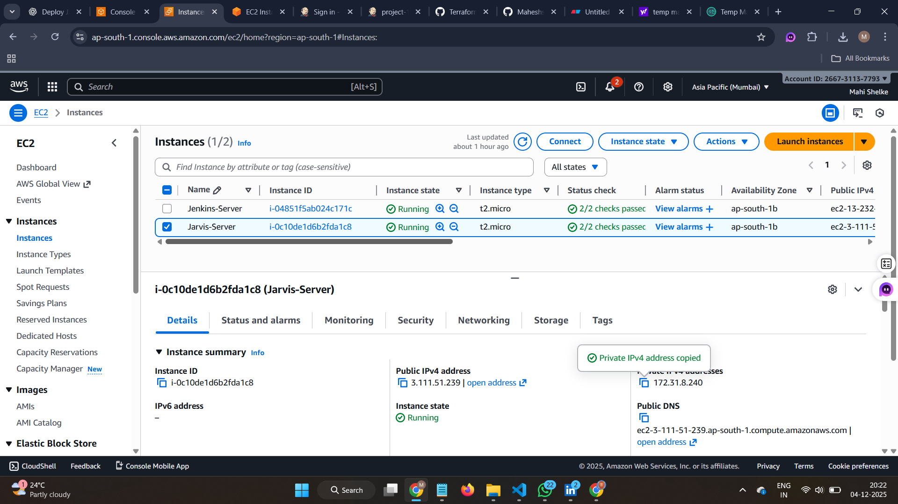
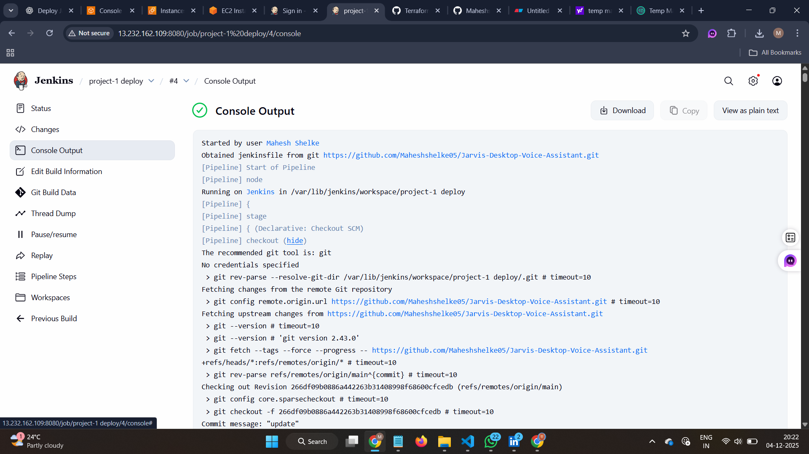
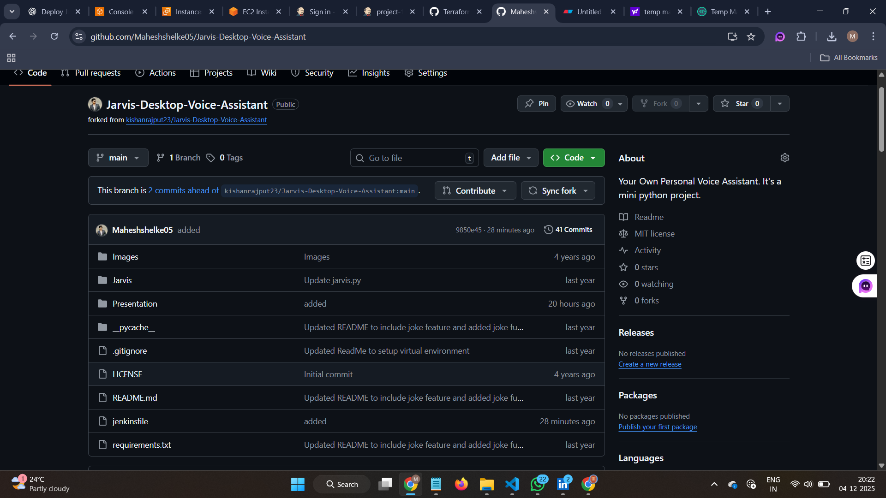
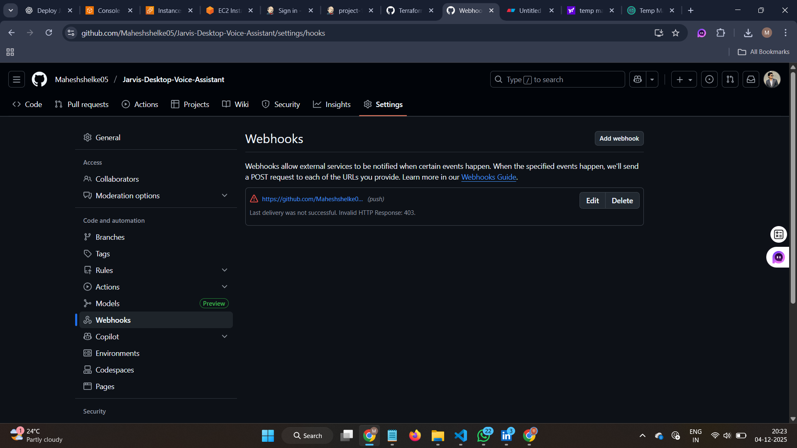
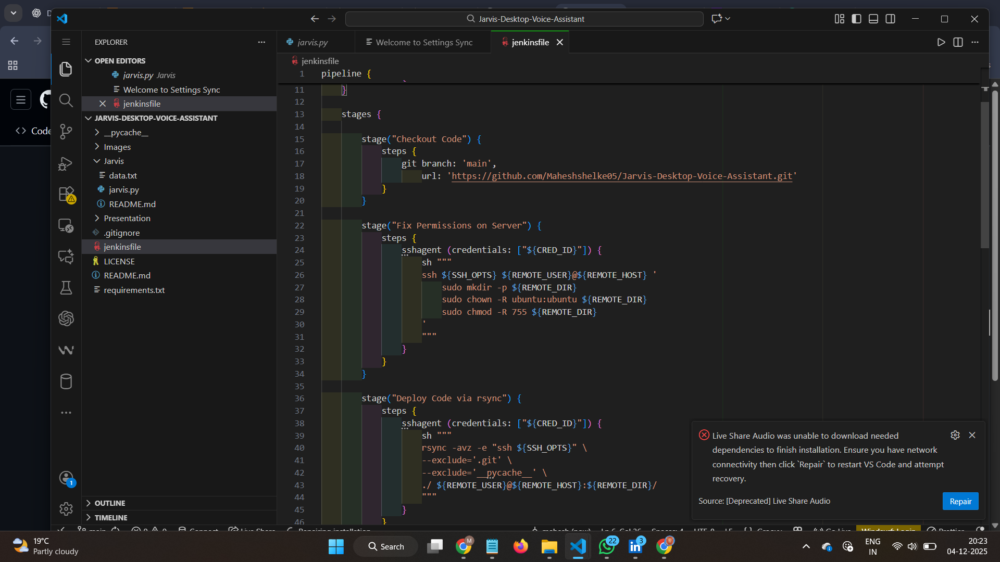
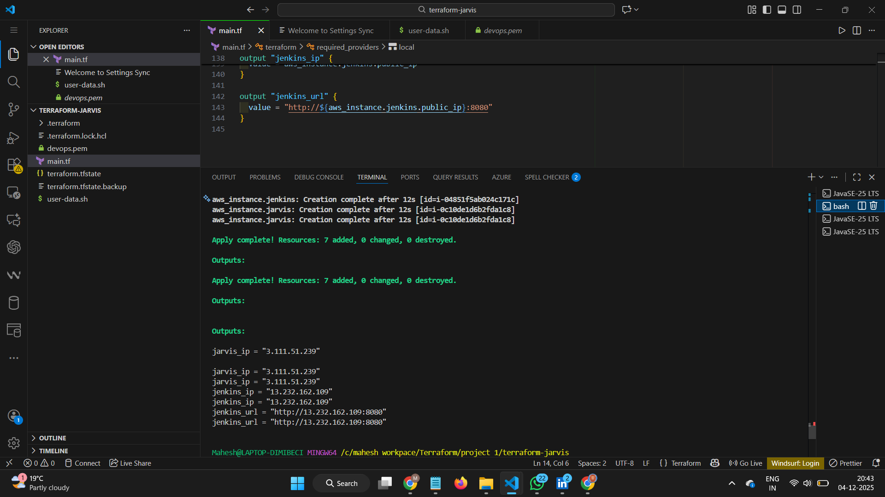

# 🚀 Automated Deployment of Jarvis Voice Assistant Using Terraform & Jenkins CI/CD on AWS
## 📌 Project Overview

This project demonstrates the **automated deployment** of a Python-based  
**Jarvis Voice Assistant** application on **AWS EC2** using a complete  
**DevOps CI/CD pipeline**.

First, **Terraform** is used to automatically create all the required cloud infrastructure —  
including EC2 instance, security groups, SSH key pair, and application setup.

Then, **Jenkins** is configured as a CI/CD tool to automate deployment.  
When a developer updates the code in **GitHub**, a webhook triggers Jenkins to pull the latest changes, transfer them to the EC2 server, install required dependencies, and restart Jarvis using **systemd** service.

As a result, the Jarvis application runs continuously on the server, and  
**every code change is deployed automatically** without any manual login or commands.

---

### 🔍 Simple Flow in One Line

👉 **Code Push → Jenkins Deploy → Jarvis Auto-Run ✔**



---
## 🧭 Project Implementation – Step by Step (How I Built This)

Below are the clear steps I followed to complete this project from scratch.

---

### 1️⃣ GitHub Setup – Jarvis Source Code

1. I went to the original project repository:  
   `Jarvis-Desktop-Voice-Assistant`
2. I **forked** the repository to my own GitHub account.
3. In my fork, I made a **small visible change** (UI/text change) so that I can verify deployments.
4. I committed and pushed the changes to the `main` branch.  
   This fork is used by Terraform (for cloning) and Jenkins (for CI/CD).

---

### 2️⃣ Infrastructure Setup with Terraform (AWS EC2 + Network)

1. I created a Terraform project folder and wrote `main.tf` to:
   - Generate an SSH key (using `tls_private_key`)
   - Create an **AWS Key Pair**
   - Create **Security Groups**:
     - Jarvis server → allow SSH (port 22)
     - Jenkins server → allow SSH (22) + Jenkins UI (8080)
   - Launch 2 EC2 instances:
     - **Jarvis EC2** – to run the Jarvis Voice Assistant
     - **Jenkins EC2** – to run Jenkins CI/CD server
2. I added `user-data.sh` to automatically:
   - Install Python, Git, required packages
   - Clone my Jarvis GitHub repo
   - Create a `jarvis.service` systemd unit
   - Enable and start the Jarvis service
3. I ran the following Terraform commands:
   ```sh
   terraform init
   terraform plan
   terraform apply -auto-approve
    ```
### 4. Record Public IPs

After successful deployment, I noted down the **Public IP** of both EC2 instances:

* `jarvis_public_ip` → **Jarvis EC2 IP**
* `jenkins_public_ip` → **Jenkins EC2 IP**
---

### 3️⃣ Verifying Jarvis EC2 (Application Server)
1. I connected to the Jarvis EC2 instance using the generated SSH key:
   ```sh
   ssh -i devops.pem ubuntu@<jarvis_public_ip>

   ```

2. I checked if Jarvis service is running:
   ```sh
   sudo systemctl status jarvis
    ```
3. Verify logs to confirm that the Python application is running:
    ```sh
    sudo journalctl -u jarvis -f
    ``` 
4. Manually restart the service if needed:
    ```sh
    sudo systemctl restart jarvis
    ```
---
## 4️⃣ Jenkins EC2 Setup (CI/CD Server)

Terraform `user_data` on Jenkins EC2 automatically performed:

- Set hostname to **jenkins**
- Installed **Java (OpenJDK)**
- Added **Jenkins repository & GPG key**
- Installed **Jenkins**
- Started **Jenkins service**

---

### 🔐 Security Group Configuration
- Allowed inbound traffic on **port 8080** to access Jenkins UI

---

### 🌍 Access Jenkins Web UI
Open the following URL in a browser:
```bash
http://<jenkins_public_ip>:8080
```
---

### 🔓 Unlock Jenkins
Retrieve the initial admin password:

```bash
sudo cat /var/lib/jenkins/secrets/initialAdminPassword
```
### ⚙️ Initial Jenkins Setup Completed

- Installed **Recommended Plugins**
- Created **Admin User**

---
## 5️⃣ Jenkins SSH Credentials Configuration

In Jenkins, navigate to:

**Manage Jenkins → Credentials → System → Global**

Add a new credential:

- **Kind:** SSH Username with Private Key  
- **ID:** devops-key *(used in Jenkinsfile)*  
- **Username:** ubuntu  
- **Private Key:** Paste the contents of `devops.pem`

This credential allows Jenkins to securely SSH into the **Jarvis EC2 Application Server** during deployment.
---
## 6️⃣ Creating Jenkins Pipeline for Deployment

In Jenkins dashboard, perform the following:

1. **New Item** → Enter a name (e.g., `project-1-deploy`)
2. Select **Pipeline**
3. Click **OK**

---

### 📌 Configure Pipeline

Scroll to the **Pipeline** section and choose:

- **Definition:** Pipeline script from SCM  
  *(or paste Jenkinsfile code directly)*

---

### 🧩 Jenkinsfile Pipeline Stages

This pipeline includes the following stages:

- **Checkout** → Pull code from GitHub repository  
- **Fix Permissions (Remote)** → Ensure  
  `/home/ubuntu/Jarvis-Desktop-Voice-Assistant` is accessible  
- **Deploy Code** → Copy files to Jarvis EC2 using `rsync`  
- **Install Dependencies** →  
  `pip install -r requirements.txt` on EC2 server  
- **Restart Service** → Restart & verify `jarvis` systemd service  

---

### 🔧 Environment Variables Used in Jenkinsfile

- `REMOTE_HOST` → Public IP of Jarvis EC2
- `REMOTE_DIR` → Deployment directory path on EC2
- `CRED_ID` → SSH key credential ID (e.g., `devops-key`)
- `SERVICE_NAME` → Application service name (`jarvis`)

---

Once done → **Save & Build Now** 🚀  
Deployment will automatically run on your EC2 server!

---
## 7️⃣ GitHub Webhook Integration (Auto Trigger Jenkins)

To enable automated CI/CD pipeline execution:

1. Go to your forked GitHub repository:
   **Settings → Webhooks → Add webhook**

2. Add the Jenkins webhook URL:
```bash
http://<jenkins_public_ip>:8080/github-webhook/
```

3. Configure the webhook:
- **Content type:** application/json
- **Trigger:** Just the push event

---

### 🚀 Result

Whenever code is pushed to GitHub:

- GitHub sends a webhook notification to Jenkins
- Jenkins pipeline automatically runs the deployment process
---

## 8️⃣ End-to-End Test of the Pipeline

To verify the complete CI/CD deployment workflow:

I made a small change in Jarvis application code (e.g., a text/message update), then pushed to the **main** branch:

```bash
git add .
git commit -m "Test CI/CD deployment"
git push origin main
```
I verified the CI/CD workflow results:

#### ✔️ Jenkins Verification
- A new build was automatically triggered by GitHub webhook
- All pipeline stages showed **Success (Green)**

#### 🖥️ Jarvis EC2 Verification
Connected to the server and checked the service:

```bash
ssh -i devops.pem ubuntu@<jarvis_public_ip>
sudo systemctl status jarvis
```
🔄 Deployment Confirmation

jarvis service was active (running)

Latest code changes were successfully reflected in the application output

🎉 End-to-End CI/CD Pipeline Tested Successfully!
---
## 9️⃣ Final Working of the Project

Now the deployment process is fully automated — no need to SSH into EC2 manually.

Whenever a code change is pushed to GitHub:

Jenkins automatically performs:

- Pull the latest code from repository
- Deploy files to EC2 server
- Install required dependencies (if any)
- Restart `jarvis` systemd service

The **Jarvis application** continues running in the background using **systemd**.

---

### ✅ Final CI/CD Flow

Code Change → GitHub Push → Jenkins Auto Trigger → Deploy on EC2 → Jarvis Auto-Run
---
## 🧩 Technologies & Services Used

### 🟠 Cloud Platform
| AWS Service | Role in Project |
|------------|----------------|
| **EC2** (Elastic Compute Cloud) | Servers for running Jarvis App & Jenkins CI/CD |
| **Security Groups** | Firewall rules: SSH (22), Jenkins (8080) |
| **IAM** | Secure key pair & access control |

---

### 🟣 DevOps Tools
| Tool | Purpose |
|------|---------|
| **Terraform** | Infrastructure as Code — deploy EC2, security groups, keys |
| **Jenkins** | Continuous Deployment Automation |
| **GitHub Webhook** | Auto trigger pipeline on code push |
| **systemd** | Run Jarvis in background & auto restart |

---

### 🔵 Programming & Software
| Technology | Usage |
|------------|------|
| **Python** | Jarvis Voice Assistant application |
| **Git** | Source code version control |
| **Linux (Ubuntu)** | Operating System for both EC2 servers |
| **pip** | Install required Python libraries |
| **SSH** | Secure remote login from Jenkins → EC2 |

---

### 🟢 Additional Tools
| Tool | Role |
|------|-----|
| **OpenJDK** | Required for Jenkins to run |
| **Rsync** | Transfer updated code from Jenkins → Jarvis EC2 |

---

### 🔍 Key Concept Used
| Concept | Advantage |
|--------|----------|
| **IaC – Infrastructure as Code** | Same setup repeat anytime with Terraform |
| **CI/CD Pipeline Automation** | No manual deployment needed |
| **Background Service (systemd)** | Jarvis always running, auto restart |

---
## 📷 Project Screenshots

### 🛠️ Terraform Resources Created Successfully


### 🔐 AWS EC2 Instances Running


### 🚀 Jenkins Pipeline Console Output (Successful Build)


### 🌍 GitHub Repo with Jenkinsfile + Code


### 🔔 GitHub Webhook Configured


### ⚙️ Jenkinsfile in VS Code


### 📡 Terraform Outputs (Public IPs)



---

🎯 Fully Automated Pipeline Verified:  
**Code → GitHub Push → Jenkins → EC2 → Systemd Auto-Run**
